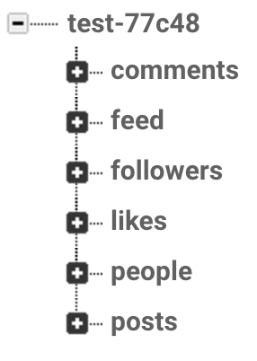
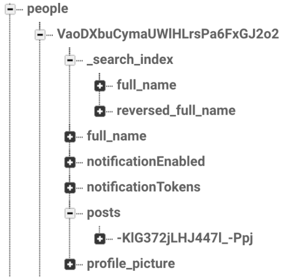
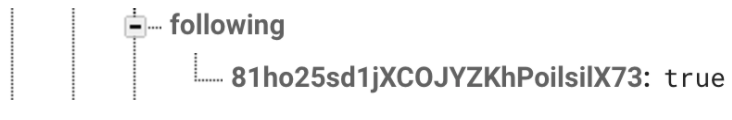
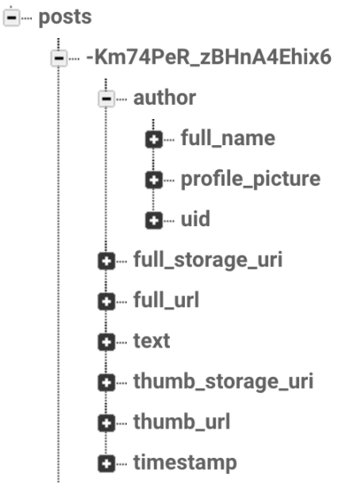
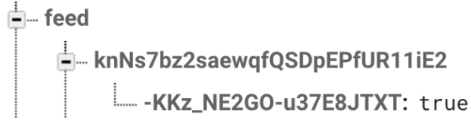
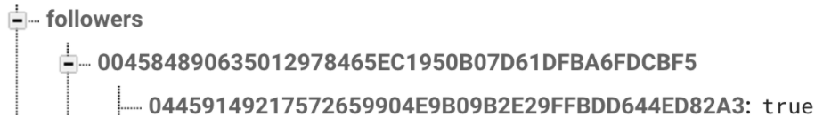
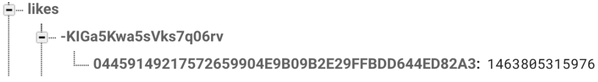
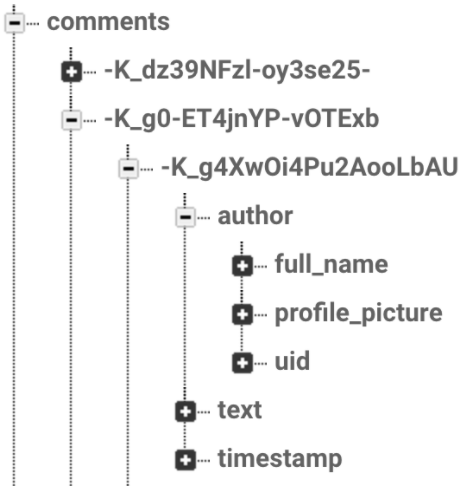

# FriendlyPix Design Details
Friendly Pix is a sample app demonstrating how a photo sharing social network can be built using the [Firebase Platform](http://firebase.google.com/).

## Database Structure

### People
people/user_id/...

people/user_id/following/followee_id

### Posts
posts/post_id/...

### Feed
feed/user_id/post_id/...

### Followers
followers/followee user_id/follower user_id/ (true or lastPostId of followee)

### Likes
likes/user_id/post_id/timestamp

### Comments
comments/post_id/comment_id/...

## Screens
### SignIn
Using FirebaseAuth with Google, Facebook, Twitter and Email SignIn with the help of FirebaseUI.

After the user signed in with one of the options, `people/user_id` is created with `full_name` and `profile_picture`. A `search_index` is created with full name and reversed full name to be searched faster with either name.

### Upload Screen
Here you can upload a photo (jpeg/gif) from your camera or your photo library to Google Storage for Firebase.

First we create a new entry in Database to get a `postID`. Then file is uploaded into `GS_root/user_id/post_id/file_name`.

Once the upload is finished, user can add a caption to photo and save it. At this time a new post is created with an `Author`, storage uris for full image and thumbnail, timestamp and text. Author object contains full_name, profile_picture and uid (user_id) for fast access later. This allows showing author info with the post later. 

Using `updateChildValues`, we add this post’s id under `people/user_id/posts/post_id` and `feed/user_id/post_id` simultaneously to avoid race conditions. With this user’s feed already has posts of their own and we have the user’s post ids with their other information in the same snapshot.

### Profile/Account Screen
#### Post/Follower/Following count
Here we show information about the user. We use user’s `posts` and `following` directories to count each. Then go to followers structure to count user’s `followers`.

#### Post View
For each post we load the post snapshot from Database with loading thumbnail picture from Storage to show here.

#### Follow/Unfollow Buttons
By checking `followers` structure, we decide the the user already following the profile or not, then update the button.

If follow is clicked, go through profile’s post ids, add them all into the user’s feed. Then set lastpost’s id as `lastpostID`. Check feed creation for the use of `lastpostID`. If profile doesn’t have any post we simply use YES value, to show that following is occured.

Once again using `updateChildValues` we update values of both the `followers/followee_user_id/user_id` with `lastPostID` and `people/user_id/following/profile_id` with `YES`. So we update both follower and following info at the same time.

Unfollowing simply reverses the follow, deletes posts from feed and removes follower/following link.

### Feed Screen
Here we see all the posts in the system. (Ranking/ordering TBD.) We simply listen for `childAdded` for `posts` in Database as it occurs for already added children for once as well. Then we load each post with their comments from `comments` resource and likes from `likes` resource. Author info inside comments lets us shows comment author’s name and photo, where liker’s id inside `likes` resource lets us check if the current user liked the post earlier or not.

If like button is pressed `likes/post_id/user_id` is created with timestamp, if unlike is pressed the entry is deleted.

### Home Screen
Here we sell only the posts our followee’s submitted and ourselves. So we’ll be pulling posts from `feed/user_id/`. Similar to feed screen, here we load each post with their comments and likes. 

#### Lazy Feed
Instead of creating each feed on post submission time, we will be using lazy creation of feed. So till the user will need a feed, we won’t be updating since the last use. There is only penalty in the first time user looks for the feed but for subsequent updates should be much faster. This way we won’t have to create/update feed regularly for inactive users.

Each time we follow a user, their previous posts are added to our feed. And their last post id is entered on `followers/followee_user_id/user_id”`. So to update the feed, we go through all the followee list by `people/user_id/following/`. For each followee we query `followers/followee_user_id/user_id` to get the last post that was updated into feed. We query the remaining posts by them from `people/followee_user_id/posts` using `queryOrderedByKey` and `queryStartingAtValue:lastSyncedPostId`.

Once again using `updateChildValues` we simultaneously update `lastsyncedId` and the feed for each post we copy. This way we don’t end up with a race condition in Database in case our connection is disrupted.
Once the current feed is updated to latest, we start listening for new additions from followers as long as the app is alive.

### Comment Screen
Comments are loaded from `comments` resource for the post and loaded. Having “author” objects under each comment entry helps to load them in the same snapshot, so that author name and picture can be shown next to the text, without a second request to Database.

If a user creates a new comment, a new entry is created with the author, text and timestamp information. 

 

